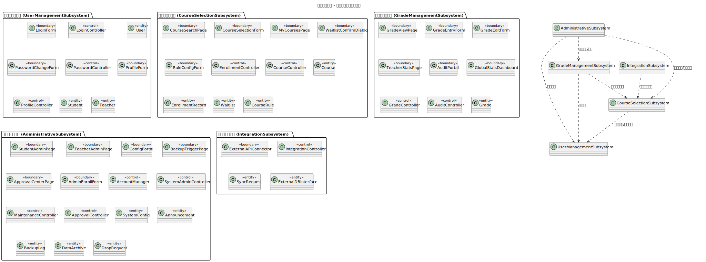

# 3. 子系统设计

本章节描述教务管理系统的子系统划分方案、类分配以及各子系统之间的依赖关系。

## 3.1 子系统划分方案

为了提高系统的可维护性和可扩展性，本系统采用了基于功能的子系统划分方案。系统共分为以下五个子系统：

1.  **用户管理子系统 (UserManagementSubsystem)**：负责用户身份验证、密码管理及个人资料维护。
2.  **选课管理子系统 (CourseSelectionSubsystem)**：核心业务子系统，负责课程搜索、选课逻辑、候补名单管理及选课规则校验。
3.  **成绩管理子系统 (GradeManagementSubsystem)**：负责成绩的录入、查询、统计分析及审核流程的初步处理。
4.  **行政管理子系统 (AdministrativeSubsystem)**：负责系统级配置、账户管理、备份维护及行政审批（如延期退课）。
5.  **系统集成子系统 (IntegrationSubsystem)**：负责与外部数据库或API进行数据同步。

## 3.2 子系统包含的类

下表列出了各子系统所包含的分析类：

| 子系统名称 | 包含的分析类 |
| :--- | :--- |
| **用户管理子系统** | `LoginForm`, `LoginController`, `User`, `PasswordChangeForm`, `PasswordController`, `ProfileForm`, `ProfileController`, `Student`, `Teacher` |
| **选课管理子系统** | `CourseSearchPage`, `CourseSelectionForm`, `MyCoursesPage`, `WaitlistConfirmDialog`, `EnrollmentController`, `CourseController`, `Course`, `EnrollmentRecord`, `Waitlist`, `CourseRule`, `RuleConfigForm` |
| **成绩管理子系统** | `GradeViewPage`, `GradeEntryForm`, `GradeEditForm`, `TeacherStatsPage`, `AuditPortal`, `GlobalStatsDashboard`, `GradeController`, `AuditController`, `Grade` |
| **行政管理子系统** | `StudentAdminPage`, `TeacherAdminPage`, `ConfigPortal`, `BackupTriggerPage`, `ApprovalCenterPage`, `AdminEnrollForm`, `AccountManager`, `SystemAdminController`, `MaintenanceController`, `ApprovalController`, `SystemConfig`, `Announcement`, `BackupLog`, `DataArchive`, `DropRequest` |
| **系统集成子系统** | `ExternalAPIConnector`, `IntegrationController`, `SyncRequest`, `ExternalDBInterface` |

## 3.3 子系统之间的依赖关系

子系统之间的依赖关系主要基于业务流程的需求。例如，选课子系统需要通过用户管理子系统验证学生身份，行政管理子系统需要操作选课及成绩数据。

### 3.3.1 包的层次结构 (Package Diagram)

图中展示了子系统之间的主要依赖路径：
- **选课**和**成绩**子系统均依赖于**用户管理**进行角色和身份识别。
- **行政管理**作为高层管理模块，依赖于下层的业务子系统进行数据操作和审批流转。
- **系统集成**为**选课**系统提供底层数据同步支持。
