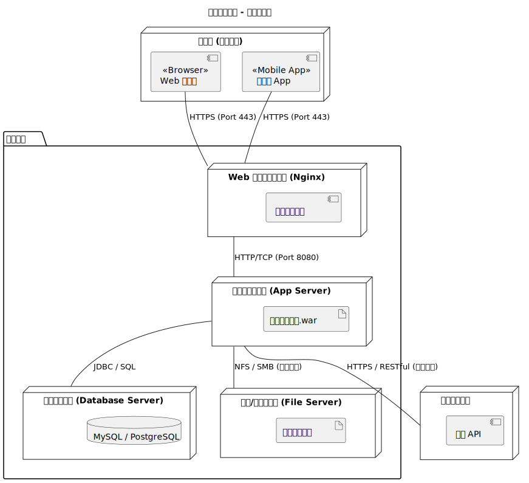

# 4. 部署建模

本章节使用部署图描述教务管理系统的物理部署结构，展示软件组件如何在硬件节点上分布及其通信协议。

## 4.1 物理部署结构

系统采用典型的三层架构（表现层、业务逻辑层、数据层）进行部署，并引入了负载均衡及外部系统集成。

### 4.1.1 部署图

## 4.2 节点说明

1.  **客户端**：学生、教师和管理员通过电脑浏览器或移动端 App 访问系统，采用加密的 HTTPS 协议。
2.  **Web 代理服务器**：使用 Nginx 提供反向代理和负载均衡，将请求分发至后端的应用服务器集群。
3.  **应用服务器集群**：运行系统的核心业务逻辑，部署为多实例集群以保证高可用性。
4.  **数据库服务器**：持久化存储所有业务数据，建议部署为主从热备结构。
5.  **外部系统**：代表学校其他业务系统，通过 RESTful API 与本系统进行数据交换。
